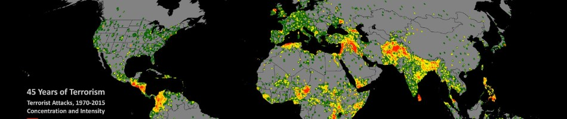

# 🌍 Terrorist Attack Data Visualization



A comprehensive data visualization project that explores global terrorist attack incidents using interactive dashboards and analytical visualizations. The objective is to uncover temporal, geographical, and operational patterns within terrorism-related data through meaningful visual analytics.

---

## 📖 Overview

This project analyzes historical terrorist attack data to answer questions such as:

* Which countries experience the highest number of attacks?
* How have attacks changed over time?
* What are the most common attack methods?
* Which terrorist organizations have been the most active?
* Which regions are most affected?
* What are the casualty trends across different attack types?

The project transforms raw data into intuitive visualizations that help identify long-term trends and patterns.

---

## 📊 Features

* 📈 Year-wise attack trend analysis
* 🌍 Country and region-wise attack distribution
* 💥 Attack type analysis
* 🎯 Target type visualization
* 🔫 Weapon type distribution
* ☠️ Casualty analysis (Killed & Wounded)
* 🏴 Terrorist organization activity
* 📍 Interactive geographical visualizations
* 📉 Statistical summaries and insights

---

## 🗂 Dataset

This project is built using the **Global Terrorism Database (GTD)** maintained by the National Consortium for the Study of Terrorism and Responses to Terrorism (START). The GTD is one of the most comprehensive open-source databases of terrorist incidents worldwide, covering events from 1970 onward.

The dataset contains information including:

* Event Date
* Country
* Region
* City
* Latitude & Longitude
* Attack Type
* Target Type
* Weapon Type
* Terrorist Group
* Number Killed
* Number Wounded
* Success of Attack
* Property Damage
* Hostage Information
* Additional Event Details

---

## 🗃 Database Schema

The primary dataset includes fields similar to:

| Column          | Description                   |
| --------------- | ----------------------------- |
| eventid         | Unique Event ID               |
| iyear           | Year of attack                |
| imonth          | Month                         |
| iday            | Day                           |
| country_txt     | Country                       |
| region_txt      | Region                        |
| city            | City                          |
| latitude        | Latitude                      |
| longitude       | Longitude                     |
| attacktype1_txt | Attack Type                   |
| targtype1_txt   | Target Type                   |
| weaptype1_txt   | Weapon Type                   |
| gname           | Terrorist Organization        |
| nkill           | Number Killed                 |
| nwound          | Number Wounded                |
| success         | Whether attack was successful |
| property        | Property damage indicator     |
| summary         | Incident summary              |

---

## 📁 Project Structure

```text
.
├── static/
│   └── dataset-cover.png
├── notebooks/
├── data/
├── visualizations/
├── README.md
└── ...
```

---

## 🛠 Technologies Used

* Python
* Pandas
* NumPy
* Matplotlib
* Seaborn
* Plotly
* Jupyter Notebook

---

## 📈 Example Analyses

* Terrorist attacks by year
* Top affected countries
* Most active terrorist organizations
* Most common attack methods
* Fatalities by region
* Weapon usage trends
* Target type distribution
* Geographic hotspot analysis

---

## 🚀 Getting Started

### Clone the repository

```bash
git clone https://github.com/Rishi-314/Terrorist-Attack-Data-Visualization.git
```

### Navigate to the project

```bash
cd Terrorist-Attack-Data-Visualization
```

### Install dependencies

```bash
pip install -r requirements.txt
```

### Run the notebooks or scripts

Open the Jupyter notebooks or execute the visualization scripts to explore the dataset.

---

## 📚 Data Source

**Global Terrorism Database (GTD)**

The GTD is an open-source database containing information on hundreds of thousands of terrorist incidents around the world. It is maintained by the National Consortium for the Study of Terrorism and Responses to Terrorism (START) at the University of Maryland.

---

## ⚠ Disclaimer

This project is intended solely for educational, research, and data visualization purposes. The dataset documents historical incidents and does not endorse or promote any individual, organization, or ideology.

---

## 👨‍💻 Author

**Rishikesh Bhagat**

* GitHub: https://github.com/Rishi-314

---

## ⭐ If you found this project useful

Give the repository a ⭐ to support the project!
